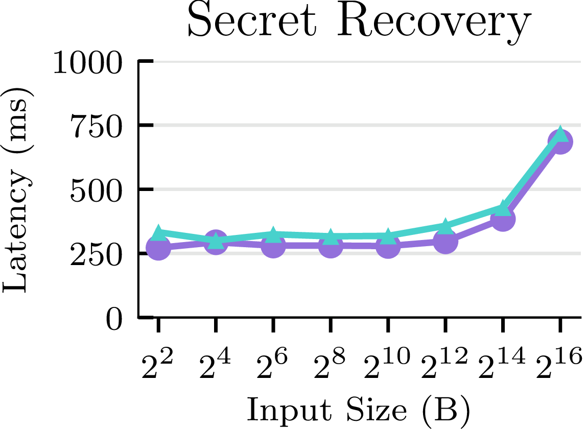
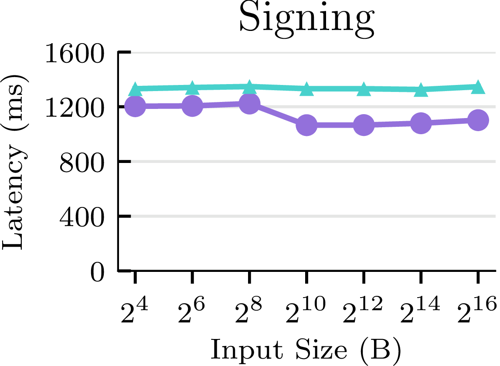
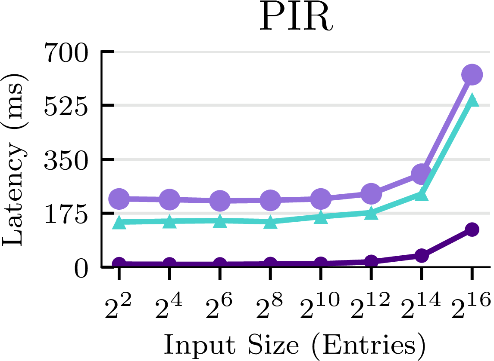
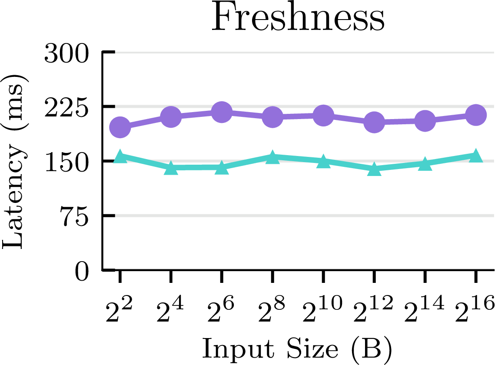
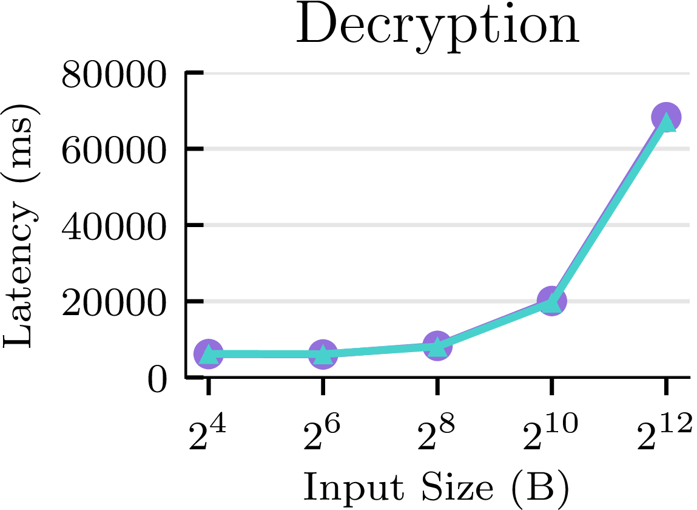
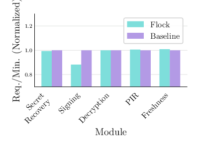
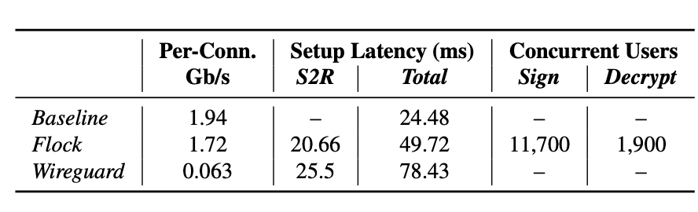

# Artifact Evaluation for Flock

Flock is a framework deploying on-demand distributed-trust.

## Overview & Setup

- [Overview & Setup](#overview--setup)
- [Baseline-Specific Setup](#baseline-specific-setup)
- [Flock-Specific Setup](#flock-specific-setup)
- [Reproduce Latency Results in Table 3 and Figure 4](#reproduce-latency-results-in-table-3-and-figure-4)
- [Reproduce Throughput Results in Figure 6](#reproduce-throughput-results-in-figure-6)
- [Reproduce Cost Results in Table 5 and Figure 7](#reproduce-cost-results-in-table-5-and-figure-7)
- [Download all Figures](#download-all-figures)
- [Reproduce Relay Microbenchmarks in Table 4](#reproduce-relay-microbenchmarks-in-table-4)
- [Cleanup](#cleanup)
- [Contact Us](#contact-us)

**We have provisioned a single set of these VMs for our artifact evaluators, and it is important that they are not used concurrently by different reviewers. Before reviewing our artifact please add your reviewer ID (e.g. A, B, or C) next to the date which you will be conducting the evaluation [on this sign-up sheet](https://docs.google.com/spreadsheets/d/1ika5A_H3YVywQKOScfom_wz2PBXXnT-mGB8C9hbLyxQ/edit?usp=sharing). If a date is claimed, please do not conduct the experiments at the same time as another reviewer. Please contact us if you have issues with this.**

We have a total of five servers:
- One AWS server simulates the user's client
- One Azure server is used as the secure relay that routes traffic between Flock's serverless containers.
- The other three servers are the distributed-trust parties in the baseline setup, located in AWS, GCP, and Azure. The Azure server is the application provider server.
- For the Flock setup, we have serverless containers deployed in AWS Lambda and Google Cloud Run.

**Step 1:** Clone the artifact evaluation repository: `git clone https://github.com/flock-org/flock-dev.git`

**Step 2:** Prepare 5 separate terminals for all relevant servers and ssh into all these servers using the below commands. We provide a ssh key `flock.pem` that gives you access to all servers. This key is uploaded to the Artifact Appendix of HotCRP. To avoid unprotected key file error, first change the permission of the key with the following command: 
```chmod 600 flock.pem```

- The client server: `ssh -i flock.pem ubuntu@ec2-13-57-39-94.us-west-1.compute.amazonaws.com`

- The AWS server: `ssh -i flock.pem ubuntu@ec2-54-177-190-187.us-west-1.compute.amazonaws.com`

- The GCP server: `ssh -i flock.pem sijun@34.94.106.191`

- The Azure server: `ssh -i flock.pem sijuntan@104.42.77.164`

- The relay: `ssh -i flock.pem azureuser@40.78.94.35`

Note down which terminal corresponds to which server, as this will be relevant throughout the experiments.

*Note:* Due to the many moving parts in our system and the variance in cloud provisioning storage and compute resources across the 3 different cloud providers and regions, we expect that at different points in time, there will be slight fluctuations in the latency and throughput values. The point of our evaluation was to show that Flock performs comparably to the baseline, and your results should reflect this regardless of such variations.

### Baseline-Specific Setup

**Step 1:** Flock's code is packaged into a Docker container in Docker's container registry. In each of the three servers (AWS, GCP, and Azure), use the following command to pull our Docker image from the registry. Note that this is not required for the client or relay servers.
```
sudo docker pull sijuntan/flock:artifact
```

**Step 2:** On each server, first create a tmux session with `tmux new -s flock`. Once the tmux session is already created, enter the tmux session with `tmux a -t flock`. Then execute the following command. This will start running Flock's Docker container. 

Use `sudo docker ps` to check if the container if already running. If the container is running, the terminal will output something like:
```
CONTAINER ID   IMAGE                   COMMAND                  CREATED       STATUS       PORTS                                                                                                                 NAMES
9ba698d5c895   sijuntan/flock:artifact   "gunicorn --certfile…"   2 hours ago   Up 2 hours   0.0.0.0:443->443/tcp, :::443->443/tcp, 0.0.0.0:5000-5200->5000-5200/tcp, :::5000-5200->5000-5200/tcp, 5201-7000/tcp   adoring_bassi
```
If so, you can stop the Docker container via `sudo docker stop <container_id>`. On each of the AWS, GCP and Azure VMs, start the Docker container via the following commands:

<a id="setup"></a>
AWS:
```
sudo docker run -p 443:443 -p  5000-5200:5000-5200 -e RELAY_CA="$(cat certs/frelay-ca.pem)" -e RELAY_CERT="$(cat certs/1/cert.pem)" -e RELAY_KEY="$(cat certs/1/key.pem)" -e USER_CA="$(cat certs/user1/user-ca.pem)" -e PARTY_CERT="$(cat certs/user1/1/cert.pem)" -e PARTY_KEY="$(cat certs/user1/1/key.pem)" -e STORAGE="aws" sijuntan/flock:artifact gunicorn --certfile="/app/certs/client.pem" --keyfile="/app/certs/client.key" --bind="0.0.0.0:443" --timeout 120 -w 8 handler:app
```

GCP:
```
sudo docker run -p 443:443 -p  5000-5200:5000-5200 -e RELAY_CA="$(cat certs/frelay-ca.pem)" -e RELAY_CERT="$(cat certs/0/cert.pem)" -e RELAY_KEY="$(cat certs/0/key.pem)" -e USER_CA="$(cat certs/user1/user-ca.pem)" -e PARTY_CERT="$(cat certs/user1/0/cert.pem)" -e PARTY_KEY="$(cat certs/user1/0/key.pem)" -e STORAGE="gcp" sijuntan/flock:artifact gunicorn --certfile="/app/certs/client.pem" --keyfile="/app/certs/client.key" --bind="0.0.0.0:443" --timeout 120 -w 8 handler:app
```

Azure:
```
sudo docker run -p 443:443 -p  5000-5200:5000-5200 -e RELAY_CA="$(cat certs/frelay-ca.pem)" -e RELAY_CERT="$(cat certs/2/cert.pem)" -e RELAY_KEY="$(cat certs/2/key.pem)" -e USER_CA="$(cat certs/user1/user-ca.pem)" -e PARTY_CERT="$(cat certs/user1/2/cert.pem)" -e PARTY_KEY="$(cat certs/user1/2/key.pem)" -e STORAGE="azure" sijuntan/flock:artifact gunicorn --certfile="/app/certs/client.pem" --keyfile="/app/certs/client.key" --bind="0.0.0.0:443" --timeout 120 -w 8 handler:app
```

### Flock-Specific Setup

Flock has two serverless deployments in AWS and GCP, and shares the Azure server with the baseline as the application provider's party:

Flock's AWS Lambda endpoint: `https://pvivrsctz64i2fvtyadqp6fioa0euhix.lambda-url.us-west-1.on.aws/`

Flock's GCP Cloud Run endpoint: `https://flock-wf6p6sulza-wl.a.run.app`

Flock's AWS Lambda and GCP Cloud Run endpoints are already up and running. You need to additionally start the Flock relay.

You should have already sshed into the relay server. Next, the script to start the relay is in the `/relay` folder of `flock-dev`. Run the following:
```
cd flock-dev/relay
bash start_relay.sh
```

This will start 4 relay processes running in the background. You can use `ps` to check if they are there. Also, you can use `pkill -f relay` to kill all the relay processes running in the background. 


## Reproduce Latency Results in Table 3 and Figure 4 

(~30 minutes)

You should have already sshed into the client server and created a tmux session with `tmux new -s flock`. The client server will sends requests to the AWS, GCP, and Azure VMs for the baseline latency benchmarks, as well as the serverless endpoints for the Flock latency benchmarks. 

First, go to the `client` repo in the client server where all the bash scripts are located:
```
cd flock-dev/client
```

All the following operations will be executed 10 times, and the average will be computed. Execute the following scripts:

```
bash latency_baseline.sh
bash latency_flock.sh
python3 figure_latency.py
```

The first two lines will run all the latency experiments and save the results in the `/results` folder as json files. Then, `figure_latency.py` will read these results and generate the corresponding figure. The figure will be generated in the `./figures` folder, which we will later show you how to download.

Note that for the PIR and freshness cryptographic modules, these are two-party operations and therefore you may notice that some VMs are unused at some points during the latency benchmarks.

## Reproduce Throughput Results in Figure 6 

(~60 min)

We have an additional AWS and GCP large server that is used to benchmark throughput for baseline. This is because the both servers get saturated before the Azure server,so the baseline's throughput is bottlenecked by them. In order to get the most realistic measurements since both baseline and Flock uses the Azure server, we choose larger servers for AWS and GCP to saturate the Azure application provider server.

ssh into the following large servers. For this particular experiment only, these will be used in place of the AWS and GCP servers you previously logged into for some of our cryptographic modules. *Make sure to keep the original AWS and GCP servers open as well.*

Log into these server via `flock.pem`, and use the same command from [the Setup section](#setup) to start the AWS and GCP server:

- AWS large server: `ssh -i flock.pem ubuntu@ec2-54-177-245-145.us-west-1.compute.amazonaws.com`

- GCP large server: `ssh -i flock.pem sijuntan@35.236.13.119`

Now run the following to pull the Docker containers:

AWS:
```
sudo docker run -p 443:443 -p  5000-5200:5000-5200 -e RELAY_CA="$(cat certs/frelay-ca.pem)" -e RELAY_CERT="$(cat certs/1/cert.pem)" -e RELAY_KEY="$(cat certs/1/key.pem)" -e USER_CA="$(cat certs/user1/user-ca.pem)" -e PARTY_CERT="$(cat certs/user1/1/cert.pem)" -e PARTY_KEY="$(cat certs/user1/1/key.pem)" -e STORAGE="aws" sijuntan/flock:artifact gunicorn --certfile="/app/certs/client.pem" --keyfile="/app/certs/client.key" --bind="0.0.0.0:443" --timeout 120 -w 8 handler:app
```

GCP:
```
sudo docker run -p 443:443 -p  5000-5200:5000-5200 -e RELAY_CA="$(cat certs/frelay-ca.pem)" -e RELAY_CERT="$(cat certs/0/cert.pem)" -e RELAY_KEY="$(cat certs/0/key.pem)" -e USER_CA="$(cat certs/user1/user-ca.pem)" -e PARTY_CERT="$(cat certs/user1/0/cert.pem)" -e PARTY_KEY="$(cat certs/user1/0/key.pem)" -e STORAGE="gcp" sijuntan/flock:artifact gunicorn --certfile="/app/certs/client.pem" --keyfile="/app/certs/client.key" --bind="0.0.0.0:443" --timeout 120 -w 8 handler:app
```

The script to measure throughput is located in `client/throughput.py`. The throughput script will launch https requests in multiple threads simutaneously. It goes over a for loop of increasing number of threads, each trial lasts ~90 second, and we record the number of requests completed between 15-75 seconds. We store the throughput results in a json file in the `results` folder for each threads we tested. When plotting the figure, we will take the maximum throughput from these trials for both Flock and the baseline.

```
bash throughput_baseline.sh
bash throughput_flock.sh
python3 figure_throughput.py
```

Similarly, the first two lines will run all the throughput experiments and save the results in the `/results` folder as json files. Then, `figure_throughput.py` will read these results and generate the corresponding figure. The figure will be generated in the `./figures` folder.

Again, we will show you how to download all your produced figures at once in a bit. If everything works well, the figures should closely resemble the following:

### Latency Figures (Figure 4)
<table>
  <tr>
    <td></td>
    <td></td>
    <td></td>
  </tr>
<tr>
    <td></td>
    <td></td>
  </tr>
</table>

### Throughput Figures (Figure 6)


## Reproduce Cost Results in Table 5 and Figure 7

We offer a python script that computes our calculations for cloud cost. The script hardcodes the cloud pricing statistics as of December 2023. Run the below in order to generate the data seen in the cost table:

```
python3 cost.py
```

## Download all Figures & Results
You can download all generated figures and json results via the following command:
```
scp -r -i flock.pem ubuntu@ec2-13-57-39-94.us-west-1.compute.amazonaws.com:~/flock-dev/figures .
scp -r -i flock.pem ubuntu@ec2-13-57-39-94.us-west-1.compute.amazonaws.com:~/flock-dev/results .
```

## Reproduce Relay Microbenchmarks in Table 4 

(~30 min)

Note: We use slightly different clouds for each of the VMs for the different parties in these microbenchmarks compared to the rest of the experiments, so please take note!

### Baseline Results (Row 1 of Table 4)

**Throughput**

Start test server on GCP, which runs [goben](https://github.com/udhos/goben/tree/master), a go-based throughput measurement tool:

```
~/scripts/throughput.sh server
```

Start test client on Azure, which runs goben 10 times and prints out average:

```
~/scripts/throughput.sh client 34.94.106.191
```

Compare this value to "Per-Conn. Gbps" of Row 1.

**Latency**

Start the server on GCP:

```
cd flock-dev
export USER=user1
export NAME=1
export DEST=0
export MODE=server
./relay/bin/client_func
```

Start a client on Azure:

```
cd flock-dev
export USER=user1
export NAME=0
export DEST=1
export MODE=client
export TARGET=34.94.106.191:9000
./relay/bin/client_func
```

This will print out the baseline latency over 10 iterations
Compare this value to Setup Latency (ms) Total in row 1.
Note: Due to the variance in cloud provisioning storage and compute resources across the 3 different cloud providers and regions, we emphasize that the baseline latency may vary by < +-20 ms from the paper. However, this is a fixed cost, and the delta observed in comparison with Flock’s latency should be comparable to the paper.

### Relay Results

Start Flock Relay on AWS:

```
cd ~/flock-dev
./relay/bin/relay start --port 9000
```

**Throughput**

Start Goben on GCP:

Set Env Variables required to contact relay:

```
cd ~/flock-dev
export RELAY=54.177.190.187:9000
export RELAY_CA=$(cat certs/frelay-ca.pem)
export RELAY_CERT=$(cat certs/1/cert.pem)
export RELAY_KEY=$(cat certs/1/key.pem)
export USER_CA=$(cat certs/user1/user-ca.pem)
export PARTY_CERT=$(cat certs/user1/1/cert.pem)
export PARTY_KEY=$(cat certs/user1/1/key.pem)
export DEST=0
```

Start throughput test using goben:

```
~/scripts/throughput.sh relay
```

Start Goben on Azure:

Set Env Variables required to contact relay:

```
cd ~/flock-dev
export RELAY=54.177.190.187:9000
export RELAY_CA=$(cat certs/frelay-ca.pem)
export RELAY_CERT=$(cat certs/0/cert.pem)
export RELAY_KEY=$(cat certs/0/key.pem)
export USER_CA=$(cat certs/user1/user-ca.pem)
export PARTY_CERT=$(cat certs/user1/0/cert.pem)
export PARTY_KEY=$(cat certs/user1/0/key.pem)
export DEST=1
```

Start throughput test using Goben:

```
~/scripts/throughput.sh relay
```

Compare this value to "Per-Conn. Gbps" of Row 2.

**Latency**

Make sure the relay is running in the AWS VM.

Start Client Function in GCP:

```
cd ~/flock-dev
export MODE=""
export TEST=latency

./relay/bin/client_func
```

Start Client Function in Azure:

```
cd ~/flock-dev

export MODE=""
export TEST=latency

./relay/bin/client_func
```
Now, S2R latency and E2E latency will be printed on the azure VM.
Note: Again, like before, due to the variance in cloud provisioning storage and compute resources across the 3 different cloud providers and regions, we emphasize that the baseline latency may vary by < +-20 ms from the paper. However, this is a fixed cost, and the delta observed in comparison with baseline’s latency should be comparable to the paper.

Now stop the relay running in AWS VM by pressing Ctrl+c or the following command:

```
killall relay
```

### Wireguard

Start Wireguard Relay on the AWS VM:

```
cd ~/serverless-relay
wgrelay start --port 9000
```

Start Wireguard setup on GCP VM:

```
~/scripts/wireguard.sh gcp
```

Start Wireguard setup on Azure VM:

```
~/scripts/wireguard.sh azure
```

**Throughput**


Run Goben server on the GCP VM:

```
~/scripts/throughput.sh server
```

Run Goben client the Azure VM:

```
~/scripts/throughput.sh client 10.201.2.1
```

Compare this value to "Per-Conn. Gbps" of Row 1.

### Latency

Rerun Wireguard setup on Azure VM, and setup latency would be printed:

```
~/scripts/wireguard.sh azure
```

Note: The latency we observed for all benchmarks would be increasing by a factor due to the current setup. However, the pattern would remain the same, e.g. baseline latency would be lower than the total latency observed with relay which would be lesser than that of wireguard
Baseline < Relay < Wireguard is what our results convey.

Now stop the relay running in AWS VM by pressing Ctrl+c or the following command:

```
killall wgrelay
```
## Scale (Concurrent Users) Relay Test

Make sure relay is running in AWS VM using the following command:

```
cd ~/flock-dev/
./relay/bin/relay start --port 9000
```

Make sure the following env variables are set in GCP VM

```
cd ~/flock-dev
export RELAY=54.177.190.187:9000
export RELAY_CA=$(cat certs/frelay-ca.pem)
export RELAY_CERT=$(cat certs/1/cert.pem)
export RELAY_KEY=$(cat certs/1/key.pem)
export USER_CA=$(cat certs/user1/user-ca.pem)
export PARTY_CERT=$(cat certs/user1/1/cert.pem)
export PARTY_KEY=$(cat certs/user1/1/key.pem)
export DEST=0

```

Make sure the following env variables are set in Azure VM

```
cd ~/flock-dev
export RELAY=54.177.190.187:9000
export RELAY_CA=$(cat certs/frelay-ca.pem)
export RELAY_CERT=$(cat certs/0/cert.pem)
export RELAY_KEY=$(cat certs/0/key.pem)
export USER_CA=$(cat certs/user1/user-ca.pem)
export PARTY_CERT=$(cat certs/user1/0/cert.pem)
export PARTY_KEY=$(cat certs/user1/0/key.pem)
export DEST=1

```

Run the throughput scale test on Azure and GCP VM with signing operation

```
cd ~/flock-dev
~/scripts/scale_ops.sh signing
```

The Total throughput will be printed on the screen after few minutes.

Once this is finished, run the throughput scale test with decrypt option on Azure and GCP VM

```
cd ~/flock-dev
~/scripts/scale_ops.sh decrypt
```

The Total throughput will be printed on the screen after few minutes.

As mentioned above, please compare the individual results to the below table



## Cleanup

To ensure all the VMs are ready for the next reviewer, please conduct the following cleanup operations:

- Also, run Ctrl+C on all VMs and `exit` to leave all tmux sessions.
- Kill the relay in the Azure and AWS VMs (note that the relay for the microbenchmarks happened to be conducted in AWS and the other benchmarks is in Azure, so make sure to kill both relays):
```
killall relay
```

## Contact Us
If you run into any issues or have any questions, please contact us on HotCRP or via email at `sijuntan@berkeley.edu` and `daryakaviani@berkeley.edu`, and we will reply promptly!

## Debugging & Common Issues

Some warnings and errors that should not concern you:
- `warn("sha3 is not working!")`: This warning is due to an underlying library, and does not pose a problem for our system.
- JSON decode errors may occur when there was a rate-limiting issue on behalf of one of the clouds due to our frequent queries in the benchmarks. In these cases, you do not need to do anything since the system will just try again to obtain the result.
