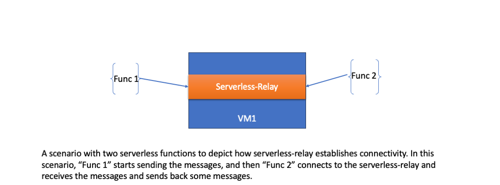

# Frelay
A Relay maintaining persistent connection between serverless functions for Flock. 
A relay is needed when two clients want to send communicate between each other without having to host a server, and maintaining connections.
This is especially the case when we want one or more serverless functions/jobs to communicate with each other.

# Why is this needed?
A serverless job generally doesnt accept incoming connections. Hence, when two serverless jobs needs to communicate with each other, they would need to connect through a central relay/router.

# How does frelay solve this?

The serverless-relay runs as a separate process within a VM.

It does the following:
1) Binds and listen to a specific port, for the job/function to connect and send messages to the remote service. The remote service is already discovered by the gateway. 
2) The relay at one end accepts connection from a func1, and other end accepts connection from func2. Ideally it should validate the func1 & func2 using their certificates. 
3) When both funcs connect to the relay, an end-to-end connection is established, and funcs upgrade the connection to mTLS, and communicate with each other.

Details :
1) The relay starts a listener for each {func1, func2} pair communication.
2) It verifies the functions and manages routing between them.
   

# Steps to run frelay

Run the frelay and add two parties (which would run as server functions) to connect.

## Build

Build the local executables

   make build

Build client docker image for local image

   make docker-build

Build and upload flock_client_func image to repos 

   make build-image push-image

## Generate Certs for relay and the parties (user functions)

   ./bin/fr-adm create relay

### Application/Relay 
   ./bin/fr-adm create user --name user1

### Alice/user1   
   ./bin/fr-adm create party --name 0 --user user1
   ./bin/fr-adm create party --name 1 --user user1
   ./bin/fr-adm create party --name 2 --user user1

The certs are now stored int 'certs/' directory.
 
## Start Frelay

   ./bin/relay start --port 6000

# Run Party 0 

   export RELAY=54.177.190.187:6000
   export RELAY_CA=$(cat certs/frelay-ca.pem)
   export RELAY_CERT=$(cat certs/0/cert.pem)
   export RELAY_KEY=$(cat certs/0/key.pem)
   export USER_CA=$(cat certs/user1/user-ca.pem)
   export PARTY_CERT=$(cat certs/user1/0/cert.pem)
   export PARTY_KEY=$(cat certs/user1/0/key.pem)
   export DEST=1
   ./relay/bin/client_func

or
   docker run -e "RELAY=10.241.64.7:9000" -e "USER=user1" -e "NAME=0" -e "DEST=1" client_func:latest

# Run Party 1

   export RELAY=54.177.190.187:9000
   export RELAY_CA=$(cat certs/frelay-ca.pem)
   export RELAY_CERT=$(cat certs/1/cert.pem)
   export RELAY_KEY=$(cat certs/1/key.pem)
   export USER_CA=$(cat certs/user1/user-ca.pem)
   export PARTY_CERT=$(cat certs/user1/1/cert.pem)
   export PARTY_KEY=$(cat certs/user1/1/key.pem)
   export DEST=0
   ./relay/bin/client_func

or 
   docker run -e "RELAY=10.241.64.7:9000" -e "USER=user1" -e "NAME=1" -e "DEST=0" client_func:latest

### Update secrets in ibmcloud
ibmcloud ce secret create -n flockpartsec0 --from-file RELAY_CA=certs/frelay-ca.pem --from-file RELAY_CERT=certs/0/cert.pem --from-file RELAY_KEY=certs/0/key.pem --from-file USER_CA=certs/user1/user-ca.pem --from-file PARTY_CERT=certs/user1/0/cert.pem --from-file PARTY_KEY=certs/user1/0/key.pem

ibmcloud ce secret update -n flockpartsec1 --from-file RELAY_CA=certs/frelay-ca.pem
ibmcloud ce secret update -n flockpartsec1 --from-file RELAY_CERT=certs/1/cert.pem
ibmcloud ce secret update -n flockpartsec1 --from-file RELAY_KEY=certs/1/key.pem
ibmcloud ce secret update -n flockpartsec1 --from-file USER_CA=certs/user1/user-ca.pem
ibmcloud ce secret update -n flockpartsec1 --from-file PARTY_CERT=certs/user1/1/cert.pem
ibmcloud ce secret update -n flockpartsec1 --from-file PARTY_KEY=certs/user1/1/key.pem

### Running dockers with certs in env
sudo docker run -p 443:443 -p  5000-5100:5000-5100 -e RELAY_CA="$(cat certs/frelay-ca.pem)" -e RELAY_CERT="$(cat certs/0/cert.pem)" -e RELAY_KEY="$(cat certs/0/key.pem)" -e USER_CA="$(cat certs/user1/user-ca.pem)" -e PARTY_CERT="$(cat certs/user1/0/cert.pem)" -e PARTY_KEY="$(cat certs/user1/0/key.pem)"  praveingk/flock:certs python3 handler.py -s gcp

sudo docker run -e RELAY_CA="$(cat certs/frelay-ca.pem)" -e RELAY_CERT="$(cat certs/1/cert.pem)" -e RELAY_KEY="$(cat certs/1/key.pem)" -e USER_CA="$(cat certs/user1/user-ca.pem)" -e PARTY_CERT="$(cat certs/user1/1/cert.pem)" -e PARTY_KEY="$(cat certs/user1/1/key.pem)" -p 443:443 -p 5000-5100:5000-5100 praveingk/flock:certs python3 handler.py -s aws

sudo docker run -p 443:443 -p  5000-5100:5000-5100 -e RELAY_CA="$(cat certs/frelay-ca.pem)" -e RELAY_CERT="$(cat certs/2/cert.pem)" -e RELAY_KEY="$(cat certs/2/key.pem)" -e USER_CA="$(cat certs/user1/user-ca.pem)" -e PARTY_CERT="$(cat certs/user1/2/cert.pem)" -e PARTY_KEY="$(cat certs/user1/2/key.pem)"  praveingk/flock:certs python3 handler.py -s azure